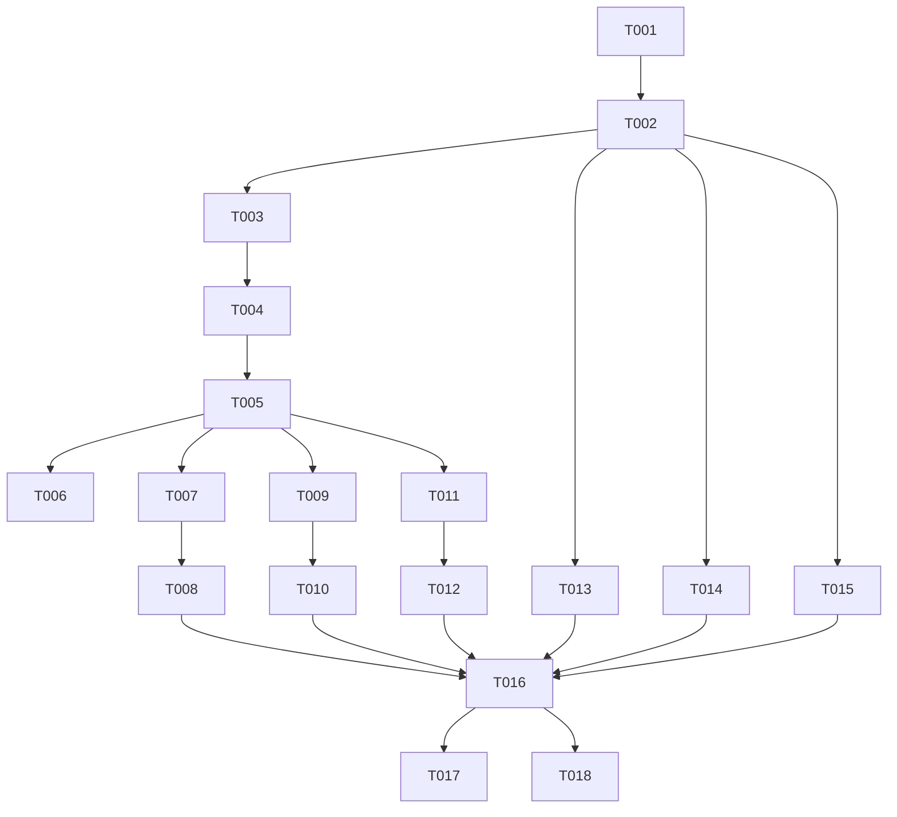

# Tasks: Spatial Optimization and Geometrical Analysis for Soft Flooring Takeoff Engine

**Feature**: `004-spatial-optimization-takeoff-engine`
**Input**: Design artifacts in `/specs/004-spatial-optimization-takeoff-engine/`

## Phase 1: Setup & Data Model Definition

- [X] T001 Define spatial polygon, strip cut, remnant, seam line, and takeoff calculation schemas in [estimation.ts](file:///c:/work/app%20making%20%20basic%20files/app%201%20carpet/carpetestimator/lib/types/estimation.ts)
- [X] T002 Create initial mathematical module structure and exports in [index.ts](file:///c:/work/app%20making%20%20basic%20files/app%201%20carpet/carpetestimator/lib/math/index.ts)

## Phase 2: Foundational 2D Geometry & Polygon Slicing

- [X] T003 Implement polygon bounding box calculation ($X_{\text{min}}, X_{\text{max}}, Y_{\text{min}}, Y_{\text{max}}$) in [TakeoffOptimizer.ts](file:///c:/work/app%20making%20%20basic%20files/app%201%20carpet/carpetestimator/lib/math/TakeoffOptimizer.ts)
- [X] T004 Implement vertical slab clipping $[x_{i-1}, x_i] \times [-\infty, \infty]$ against room polygon $P$ in [TakeoffOptimizer.ts](file:///c:/work/app%20making%20%20basic%20files/app%201%20carpet/carpetestimator/lib/math/TakeoffOptimizer.ts)
- [X] T005 Implement localized physical length ($L_{\text{section}, i}$) and raw cut length ($L_{\text{raw}, i} = L_{\text{section}, i} + 2 \cdot L_{\text{bleed}}$) in [TakeoffOptimizer.ts](file:///c:/work/app%20making%20%20basic%20files/app%201%20carpet/carpetestimator/lib/math/TakeoffOptimizer.ts)

## Phase 3: [US1] Master Roll Pattern Matching & Continuous Placement

- [X] T006 [P] [US1] Implement straight match pattern calculation ($L_{\text{pattern}, i} = \lceil L_{\text{raw}, i} / R_y \rceil \times R_y$) in [TakeoffOptimizer.ts](file:///c:/work/app%20making%20%20basic%20files/app%201%20carpet/carpetestimator/lib/math/TakeoffOptimizer.ts)
- [X] T007 [P] [US1] Implement half-drop target phase offset ($\theta_i = (i \bmod 2) \cdot \frac{R_y}{2}$) and continuous roll alignment ($v_{\text{start}, i} = v_{\text{end}} + \Delta L_{\text{pattern}, i}$) in [TakeoffOptimizer.ts](file:///c:/work/app%20making%20%20basic%20files/app%201%20carpet/carpetestimator/lib/math/TakeoffOptimizer.ts)
- [X] T008 [US1] Implement vertical coordinate offset registration ($\Phi_i = (y_{\text{start}, i} - L_{\text{bleed}}) \bmod R_y$) for stepped/staggered room polygons in [TakeoffOptimizer.ts](file:///c:/work/app%20making%20%20basic%20files/app%201%20carpet/carpetestimator/lib/math/TakeoffOptimizer.ts)

## Phase 4: [US2] Side-Cut Remnant Yield & Nesting Analysis

- [X] T009 [P] [US2] Implement active width ($W_{\text{active}, i}$) and side off-cut width ($W_{\text{rem}, i} = W_{\text{roll}} - W_{\text{active}, i} - W_{\text{seam\_trim}}$) calculation in [TakeoffOptimizer.ts](file:///c:/work/app%20making%20%20basic%20files/app%201%20carpet/carpetestimator/lib/math/TakeoffOptimizer.ts)
- [X] T010 [US2] Implement remnant nesting validator (pile direction check, physical containment check $W_t + 2L_{\text{bleed}} \le W_r$, pattern phase registration) in [TakeoffOptimizer.ts](file:///c:/work/app%20making%20%20basic%20files/app%201%20carpet/carpetestimator/lib/math/TakeoffOptimizer.ts)

## Phase 5: [US3] Orientation Optimization & CRI Compliance

- [X] T011 [P] [US3] Implement dual orientation evaluation ($0^\circ$ longitudinal vs $90^\circ$ transverse) selecting minimum total linear roll length in [TakeoffOptimizer.ts](file:///c:/work/app%20making%20%20basic%20files/app%201%20carpet/carpetestimator/lib/math/TakeoffOptimizer.ts)
- [X] T012 [US3] Implement CRI 104/105 compliance checks (light-source parallel alignment, high-traffic pivot-point avoidance, pile direction consistency) in [TakeoffOptimizer.ts](file:///c:/work/app%20making%20%20basic%20files/app%201%20carpet/carpetestimator/lib/math/TakeoffOptimizer.ts)

## Phase 6: [US4] Accessory Material Calculations

- [X] T013 [P] [US4] Implement carpet underlay padding rolls formula ($N_{\text{pad\_rolls}} = \lceil A_{\text{pad}} / 270 \rceil$) in [accessories.ts](file:///c:/work/app%20making%20%20basic%20files/app%201%20carpet/carpetestimator/lib/math/accessories.ts)
- [X] T014 [P] [US4] Implement tackless gripper rod batten count ($N_{\text{tackless\_strips}} = \lceil L_{\text{tackless}} / 4.0 \rceil$) in [accessories.ts](file:///c:/work/app%20making%20%20basic%20files/app%201%20carpet/carpetestimator/lib/math/accessories.ts)
- [X] T015 [P] [US4] Implement hot-melt seam tape roll count ($N_{\text{tape\_rolls}} = \lceil L_{\text{seam\_tape}} / 66.0 \rceil$) in [accessories.ts](file:///c:/work/app%20making%20%20basic%20files/app%201%20carpet/carpetestimator/lib/math/accessories.ts)

## Phase 7: Integration, Verification & PDF Proposal Updates

- [X] T016 Connect `TakeoffOptimizer` to unified calculation facade in [index.ts](file:///c:/work/app%20making%20%20basic%20files/app%201%20carpet/carpetestimator/lib/math/index.ts)
- [X] T017 Create Jest unit test suite for PDF Stepped L-Shape Benchmark verifying 49.25 linear feet result in [__tests__/takeoff-optimizer.test.ts](file:///c:/work/app%20making%20%20basic%20files/app%201%20carpet/carpetestimator/__tests__/takeoff-optimizer.test.ts)
- [X] T018 Update proposal PDF document rendering with detailed cut plan summary, remnants, and CRI compliance badges in [ProposalPDF.tsx](file:///c:/work/app%20making%20%20basic%20files/app%201%20carpet/carpetestimator/components/pdf/ProposalPDF.tsx)

## Dependencies & Execution Graph

