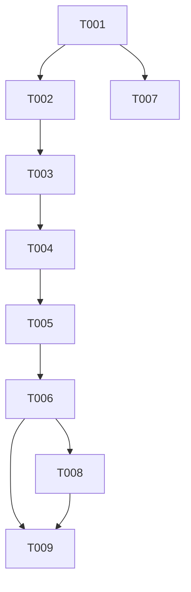

# Tasks: Two-Stage Takeoff Optimization Algorithm & Master Roll Visualizer

**Feature**: `005-two-stage-bin-packing-takeoff`
**Input**: Design artifacts in `/specs/005-two-stage-bin-packing-takeoff/`

## Phase 1: Setup & Data Model Definition

- [X] T001 Define `DecomposedCutItem`, `RemnantBlock`, `ItemPlacement`, `TwoStageOptimizationResult` in [estimation.ts](file:///c:/work/app%20making%20%20basic%20files/app%201%20carpet/carpetestimator/lib/types/estimation.ts)

## Phase 2: Stage 1 Geometric Decomposition & Item Queue Sorting

- [X] T002 Implement Stage 1 piece decomposition ($W_{\text{cut}} = W_{\text{piece}}$, $L_{\text{cut}} = L_{\text{piece}} + 2 \cdot L_{\text{bleed}}$) and area-descending sorting in [TwoStageTakeoffOptimizer.ts](file:///c:/work/app%20making%20%20basic%20files/app%201%20carpet/carpetestimator/lib/math/TwoStageTakeoffOptimizer.ts)

## Phase 3: [US1] 2D Best-Fit Decreasing Remnant Nesting & Guillotine Splitting

- [X] T003 [P] [US1] Implement Best-Fit remnant nesting search ($W_{\text{cut}} \le W_{\text{rem}}$, $L_{\text{cut}} \le L_{\text{rem}}$) in [TwoStageTakeoffOptimizer.ts](file:///c:/work/app%20making%20%20basic%20files/app%201%20carpet/carpetestimator/lib/math/TwoStageTakeoffOptimizer.ts)
- [X] T004 [US1] Implement guillotine remnant split strategy (Right sub-remnant: $W_{\text{rem}} - W_{\text{cut}}$, Top sub-remnant: $L_{\text{rem}} - L_{\text{cut}}$) in [TwoStageTakeoffOptimizer.ts](file:///c:/work/app%20making%20%20basic%20files/app%201%20carpet/carpetestimator/lib/math/TwoStageTakeoffOptimizer.ts)
- [X] T005 [US1] Implement master roll fresh cut allocation ($v_{\text{start}}, v_{\text{end}}$) and side off-cut remnant tracking ($W_{\text{new\_rem}} = W_{\text{roll}} - W_{\text{cut}}$) in [TwoStageTakeoffOptimizer.ts](file:///c:/work/app%20making%20%20basic%20files/app%201%20carpet/carpetestimator/lib/math/TwoStageTakeoffOptimizer.ts)

## Phase 4: [US2] Facade Integration

- [X] T006 [P] [US2] Integrate `TwoStageTakeoffOptimizer` into `calculateEstimate` facade in [index.ts](file:///c:/work/app%20making%20%20basic%20files/app%201%20carpet/carpetestimator/lib/math/index.ts)

## Phase 5: [US3] PDF Visualizer Overlap Fix & Master Roll Diagram

- [X] T007 [P] [US3] Fix SVG section overlapping in room visualizer by computing explicit horizontal X-offsets in [ProposalPDF.tsx](file:///c:/work/app%20making%20%20basic%20files/app%201%20carpet/carpetestimator/components/pdf/ProposalPDF.tsx)
- [X] T008 [US3] Implement 2D Master Roll Cut & Placement Diagram SVG showing full roll timeline, section names, cut dimensions ($W \times L$), and color-coded remnant off-cuts in [ProposalPDF.tsx](file:///c:/work/app%20making%20%20basic%20files/app%201%20carpet/carpetestimator/components/pdf/ProposalPDF.tsx)

## Phase 6: Verification & Automated Test Suite

- [X] T009 Create Node test suite verifying nesting of Section 2 into Section 1 side off-cut with 20.5 linear feet result in [__tests__/two-stage-optimizer.test.ts](file:///c:/work/app%20making%20%20basic%20files/app%201%20carpet/carpetestimator/__tests__/two-stage-optimizer.test.ts)

## Dependencies & Execution Graph

