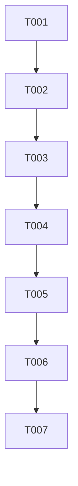

# Tasks: Pre-Slicing (Cleaving) & Length-Descending 2D Takeoff Engine

**Feature**: `006-cleaving-length-descending-takeoff`
**Input**: Design artifacts in `/specs/006-cleaving-length-descending-takeoff/`

## Phase 1: Setup & Data Model Definition

- [X] T001 Define `RawSection`, `Piece`, `Remnant`, `PlacedCut`, `NestingResult` in [estimation.ts](file:///c:/work/app%20making%20%20basic%20files/app%201%20carpet/carpetestimator/lib/types/estimation.ts)

## Phase 2: [US1] Stage 1 Pre-Slicing (Cleaving) Engine

- [X] T002 Implement Stage 1 `prepareSections` width-wise cleaving ($W_{\text{section}} > W_{\text{roll}} \implies N$ full-width strips + remainder) and Part A/B/C labeling in [FlooringTakeoffEngine.ts](file:///c:/work/app%20making%20%20basic%20files/app%201%20carpet/carpetestimator/lib/math/FlooringTakeoffEngine.ts)

## Phase 3: [US2] Stage 2 Length-Descending 2D Nesting Solver

- [X] T003 [P] [US2] Implement strict Length-Descending piece sorting (`b.length - a.length`) to prevent Area-Sorting Trap in [FlooringTakeoffEngine.ts](file:///c:/work/app%20making%20%20basic%20files/app%201%20carpet/carpetestimator/lib/math/FlooringTakeoffEngine.ts)
- [X] T004 [US2] Implement Best-Fit remnant nesting search and guillotine remnant split logic (`splitRemnant`) in [FlooringTakeoffEngine.ts](file:///c:/work/app%20making%20%20basic%20files/app%201%20carpet/carpetestimator/lib/math/FlooringTakeoffEngine.ts)
- [X] T005 [US2] Implement master roll fresh cut drawing and side off-cut remnant tracking ($W_{\text{rem}} = W_{\text{roll}} - W_{\text{piece}}$) in [FlooringTakeoffEngine.ts](file:///c:/work/app%20making%20%20basic%20files/app%201%20carpet/carpetestimator/lib/math/FlooringTakeoffEngine.ts)

## Phase 4: [US3] Facade Integration

- [X] T006 [P] [US3] Connect `FlooringTakeoffEngine` to unified calculation facade in [index.ts](file:///c:/work/app%20making%20%20basic%20files/app%201%20carpet/carpetestimator/lib/math/index.ts)

## Phase 5: Verification & Automated Test Suite

- [X] T007 Create Node test suite verifying 35 ft cleaving into Part A/B/C and Length-Descending 41 ft vs 51.5 ft Area-Trap proof in [__tests__/cleaving-takeoff.test.ts](file:///c:/work/app%20making%20%20basic%20files/app%201%20carpet/carpetestimator/__tests__/cleaving-takeoff.test.ts)

## Dependencies & Execution Graph

